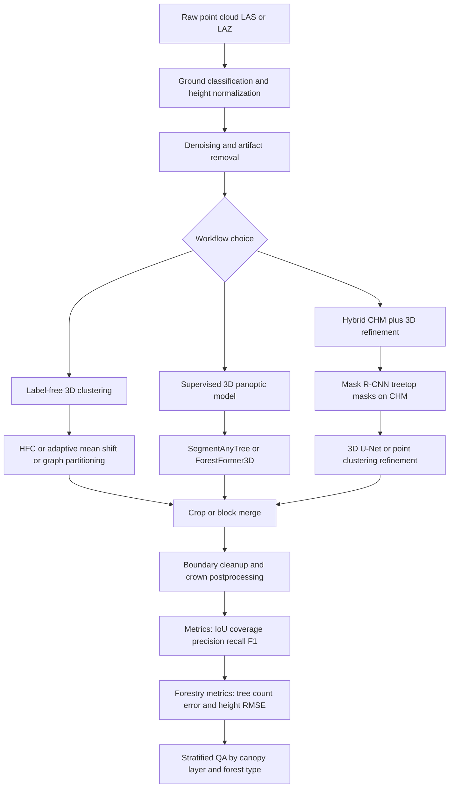

# Best Algorithms for Tree Top and Tree Crown Detection in Dense 3D Point Clouds

## Executive summary

If the question is “what is currently best, in primary-source evidence, for
dense 3D forest point clouds?”, the strongest answer is **ForestFormer3D** for
accuracy, **SegmentAnyTree** for transferability across sensors and point
densities, and **HFC or AMS3D-class adaptive mean shift methods** for label-free
production workflows. ForestFormer3D is the clearest current research leader
among the methods I reviewed: it leads the challenging FOR-instanceV2 benchmark
and also tops the newer FGI-EMIT multispectral ALS benchmark, including
substantially better understory performance than the strongest unsupervised
baseline and superiority down to 10 pts/m². SegmentAnyTree is the most
compelling “one-model-across-many-sensors” option because it was explicitly
designed for ULS, MLS, TLS, and sparse-ALS-like conditions via aggressive
density augmentation. Among non-deep-learning methods, adaptive mean shift
remains a very strong geometric family, and HFC is the best recent point-based
classical method I found for mixed-species UAS LiDAR, with high robustness to
species mixture and leaf-on/leaf-off changes.
citeturn7view1turn31view0turn11view2turn42view1turn26view0turn20view0

Compared with the classic **Li et al. 2012** point-cloud region-growing
baseline, the main improvements over the last decade are not just “better
clustering.” They are: adaptive bandwidths and multi-stage clustering to reduce
over-/under-segmentation; stem-aware graph partitioning to stabilize stopping
criteria; density-aware deep models that learn offsets, centers, or masks
directly from points; and transformer-based query decoders plus block-merging
strategies that scale to large forest scenes. Li2012 remains historically
important because it moved individual-tree segmentation directly into 3D point
space, but in current practice it is mainly a baseline or a lightweight
fallback: the commonly used lidR implementation is reported as **not
parallelized** and to have **worse-than-O(N²)** complexity, which is a serious
disadvantage on dense point clouds.
citeturn51search1turn25view0turn51search5

A second headline finding is that **dense canopy and understory remain the
hardest failure mode** even for recent methods. A recent broadleaf benchmark
found that all tested algorithms performed reasonably on canopy trees but
**failed on understory trees**, although AMS3D had the best overall accuracy
among the compared methods. Recent deep models narrow that gap: ForAINet still
showed a large difference between dominant-canopy and understory F-score, while
ForestFormer3D and SegmentAnyTree improve transfer and understory handling
substantially, and FGI-EMIT confirms that modern deep methods remain better than
unsupervised ones even at 10 pts/m². Still, no paper I reviewed shows that dense
multilayer tropical or temperate broadleaf forests are “solved.”
citeturn26view0turn14view1turn31view0turn11view2

The practical implication is straightforward. For **batch, highest-accuracy,
research-grade or production-grade segmentation with labels available**, choose
a modern transformer or sparse-3D panoptic model and fine-tune it locally. For
**no-label or weak-label workflows**, use a robust 3D clustering method such as
HFC or adaptive mean shift, and accept that canopy tops will be easier than
suppressed trees. For **conventional ALS around the low end of your
threshold**—roughly 8–20 pts/m²—models explicitly tested for density robustness
are much safer than methods developed only on ultra-dense ULS.
citeturn31view0turn11view2turn15view4turn42view1

## What the literature shows

The literature now falls into a few clear families. **Local-maxima and
CHM-seeded methods** are still useful as fast coarse detectors and as seed
generators in hybrids, but they are usually weaker than full 3D methods in
multilayer canopies because the CHM collapses vertical structure. **Point-cloud
region growing and clustering methods** work directly in 3D and include
Li2012-style spacing-based growing, adaptive mean shift, graph-cut partitioning,
watershed-plus-clustering hybrids, and stem-guided clustering. **Deep 3D
methods** split again into point/voxel models such as PointNet-style voxel
classification, sparse 3D CNN or PointGroup-style instance segmentation, and
newer **transformer-based panoptic models** مثل ForestFormer3D. **Multi-scale
and multi-view fusion** methods bridge 2D and 3D by using CHM or imagery to
detect tree tops or crown masks first, then refining boundaries in 3D point
space.
citeturn25view0turn37view0turn34view0turn11view1turn33view1turn46view0

For dense forests, the key data requirements are not just nominal point density
but also **how those points are distributed vertically**. A very important
example is Dersch et al. 2021: they used airborne data with **more than 200
points/m²**, yet their stem-sensitive method still required that stems
themselves have at least **five points per meter** to make automatic stem
detection work well. Conversely, ForAINet showed that point-density robustness
is not linear: its performance stayed within about 5 percentage points down to
**75 pts/m²**, but it became challenged below **100 pts/m²**, and omission
errors increased markedly below 75. SegmentAnyTree and the FGI-EMIT benchmark
show a more encouraging picture for newer deep models, which remain better than
unsupervised methods even at **10 pts/m²**, but that does not mean their
performance is flat across densities; omission of small or understory trees
still rises as density falls.
citeturn37view0turn15view4turn11view2turn31view0

Noise, seasonality, and occlusion matter almost as much as density. HFC is the
clearest recent example of explicit robustness engineering: it applies
**intensity filtering, SVD filtering, and Statistical Outlier Removal**, then
clusters and merges remaining structure; on multiple UAS datasets it showed only
**1–3 percentage-point** F1 variation under mixed-species effects and **1–2
percentage-point** variation between leaf conditions. Adaptive mean shift also
shows good density robustness when bandwidth adapts to canopy structure rather
than remaining fixed. By contrast, methods that depend heavily on a clean canopy
surface or a single set of manually tuned thresholds are more brittle in
broadleaf or mixed stands. citeturn40view0turn42view1turn20view0

Preprocessing is converging to a stable recipe. The recurring steps are:
**ground classification and height normalization**, **outlier removal**,
**optional intensity or return-feature normalization**, then either seed
generation or direct crop-based inference. In the classical literature, CHM
generation itself can strongly change results, and local-maxima methods usually
benefit from smoothing and variable windows rather than fixed windows. In deeper
3D methods, preprocessing usually shifts from hand-designed crown geometry
toward **blocking/cropping, density augmentation, and semantic filtering**.
ForAINet, for example, reports gains from adding features such as return number,
scan-angle rank, and hand-crafted geometric descriptors, and even larger gains
from **TreeMix** augmentation; ForestFormer3D explicitly uses **cylindrical
overlapping crops**, **score-based block merging**, and boundary-mask
suppression to handle very large scenes.
citeturn25view0turn14view0turn13view0turn7view0

Feature engineering has not disappeared. It has just moved. In classical 3D
methods, the important features are height, local density, crown width–height
relations, point spacing, verticality, and stem-likelihood cues. HFC adds
intensity and local linearity through SVD. Dersch’s graph-cut method relies on
vertical-line stem detection. In deep methods, raw XYZ alone can still work, as
in the early PointNet forestry paper, but better panoptic models often improve
when additional LiDAR attributes are present or when the network can learn
center offsets or object queries. ForAINet explicitly tested **intensity**,
**return number**, **scan-angle rank**, and **hand-crafted statistical
features**; ForestFormer3D adds instance-aware query-point selection and
score-based merging rather than relying on one single hand-designed crown model.
citeturn35view4turn40view0turn37view0turn14view0turn7view0

Training labels are the main bottleneck for the best current methods. The most
useful labels are **per-point instance IDs** for entire trees, and ideally
**per-point semantics** such as ground, low vegetation, stem, live branch, dead
branch, wood, and leaf. FOR-instance was created specifically to standardize
this problem for dense UAV laser scanning data, and FOR-instanceV2 expands it
dramatically by adding new regions and sensor modalities. TreeLearn is also
notable because it trained on **6,665 trees** and added a hand-segmented
benchmark of **156 full trees**. FGI-EMIT is the most relevant new ALS benchmark
because it supplies **1,561 manually annotated trees** with an emphasis on
smaller understory trees.
citeturn30search8turn6view1turn30search3turn31view0

Evaluation should not stop at tree count. The strongest recent papers report
**precision, recall, and F1** for tree instances, usually by matching predicted
and reference point sets using **IoU ≥ 0.5**; they also report a **coverage**
metric, which is essentially the average best IoU per reference tree, plus
semantic **mIoU** when a panoptic model is used. For downstream forestry,
**RMSE** of tree height and crown dimensions on matched trees is also important.
This is a better evaluation design than using stand totals alone, because
stand-level biomass or tree-count agreement can hide severe over- and
under-segmentation at the individual-tree level.
citeturn6view1turn13view0turn46view0turn26view0

In computational terms, the families behave very differently. Li2012-style
region growing is the least scalable among the common baselines. CHM-seeded
methods are usually the fastest. Mean-shift and graph-cut methods are
intermediate: more expensive than CHM watershed, but still often practical
plot-by-plot. Modern deep methods shift cost into training and GPU memory, then
regain scalability at inference by using overlapping windows or cylinders plus
post-merge logic. ForestFormer3D and SegmentAnyTree both depend on scene
cropping; ForAINet and PointNet papers report moderate-to-large training cost
and explicit GPU use. None of the recent 3D forest panoptic papers I reviewed
claims true large-scene “real-time” end-to-end crown delineation; the realistic
distinction today is **high-throughput batch** versus **fast-enough plot
processing**, not real-time robotics.
citeturn25view0turn7view0turn11view2turn35view2

## Detailed comparison of promising methods

The table below focuses on methods from roughly the past decade that are either
strong performers, important architectural steps beyond Li2012, or practically
useful baselines. “Runtime” is included where the consulted source reported it;
otherwise it is marked as not reported.

| Method | Year | Core type | Data type | Point density evidence | Representative performance | Runtime and scalability | Code availability | Notes for >8 pts/m² |
|---|---:|---|---|---|---|---|---|---|
| **AMS3D / adaptive mean shift family** | 2016–2022 | 3D adaptive clustering | ALS, UAV, dense photogrammetric clouds | Broadleaf benchmark on airborne LiDAR; separate AMS study validated on UAV LiDAR around **45 pts/m²** and found accuracy dropped with density but **75%** of original density still satisfied most needs | Best overall accuracy among four algorithms in a broadleaf ALS benchmark; AMS paper reported average **F = 0.83** and strong crown-width accuracy on UAV LiDAR validation | Usually superlinear neighborhood clustering; much more scalable than Li2012 but slower than CHM watershed | Official/public code not clearly identified in the consulted primary sources | Best classical “no labels” family when crowns are dense but reasonably separable; prefer **adaptive** over fixed bandwidths and use mean-shift voxelization when available. citeturn26view0turn20view0 |
| **Graph-cut clustering with stem detection** | 2021 | Graph partitioning + object-based stem detection | Very dense airborne LiDAR | Tested on leaf-on airborne LiDAR with **>200 pts/m²**; needs around **5 stem points per meter** for stem detection to work reliably | Stem detection alone found **>80%** of stems with **>70%** precision; adding stems improved segmentation F-score by up to **15%** versus graph-cut alone and up to **22%** versus existing methods in one reference setting | More scalable than Li2012 because stem-guided stopping stabilizes recursive partitioning; still not a light method | No public implementation located in the sources consulted | Excellent if you truly have dense airborne/UAV data with visible stems; not a good fit when your canopy is dense but stem returns are sparse. citeturn37view0 |
| **PointNet voxel classification + gradient merging** | 2021 | Point-based deep learning | UAV LiDAR | Four UAV test sites, including mixed and defoliated stands | Overall **recall 0.85, precision 0.87, F-score 0.86** on **1,305** trees | Reported **~100 h total training and testing** on **RTX 2080Ti**; voxelization and manual voxel-size choice reduce scalability and generality | No official forestry code identified in the consulted sources | A historically important direct-point deep baseline. Use **1024 points/voxel**, **lr 1e-4**, **batch 16**, **200 epochs**, and set voxel XY size close to typical crown width of the stand. citeturn36view1turn35view2turn35view4 |
| **Extreme offset deep learning** | 2023 | Offset-learning + adaptive mean shift + aggregation | ALS | Tested on conifer and mixed plots in the U.S. and Germany | Promising but I did not recover a benchmark table strong enough to compare directly with more recent public benchmarks | Uses marked **25×25 m** subplots and point offsets toward treetops; intended to improve separation in dense canopies | No public repo identified in the consulted sources | Interesting if you want a Li2012 successor that still thinks in terms of crown centers and clustering, but it has weaker public benchmark evidence than HFC, ForAINet, SegmentAnyTree, or ForestFormer3D. Paper reports **lr 0.001**, **900 sampled points**, **16 neighbors**, **3 upsampling blocks**. citeturn34view1 |
| **HFC** | 2024 | Hierarchical filtering + clustering | UAS LiDAR; also tested on FOR-instance | Mixed species and leaf-on/leaf-off UAS datasets; FOR-instance evaluation | On FOR-instance six plots: average **P/R/F1 = 0.88/0.82/0.85**, better than Xiang2023 at **0.69** average F1; on England/Germany datasets, HFC stayed around **0.88–0.89** F1 with constant parameters and showed only **1–3 pp** species-mix sensitivity and **1–2 pp** leaf-condition sensitivity | Plot-level point-based workflow; no training cost; strong production candidate when GPU labels are unavailable | GitHub repo exists; code distribution requires agreement according to repository README | One of the best practical no-label methods for mixed-species UAS LiDAR. Recommended default: keep the full **intensity + SVD + SOR** filtering stack and start with the paper’s constant-parameter setting before any plot-specific tuning. citeturn42view0turn42view1turn40view0turn38search1 |
| **ForAINet** | 2024 | Sparse 3D deep panoptic segmentation | Designed for high-density ALS; evaluated on FOR-instance ULS benchmark | Densities in the benchmark plots ranged from **498** to **9,529 pts/m²**; performance remained within ~5 pp down to **75 pts/m²**, but deteriorated below **~100 pts/m²** | Best configuration reached **F-score 85.1** and **mIoU 73.5**; dominant-tree F-score **82.9**, understory **39.3** in one analysis | Python + **Torch-Points3D**; experiments on **8-core Intel CPU** and **Titan RTX 24 GB**; large scenes still require plot/block processing | Official GitHub repo available | Good if your data are truly dense and you want joint semantic + instance segmentation. Use **TreeMix** augmentation, keep **return number** and **hand-crafted features**, and treat **<75–100 pts/m²** as a warning zone unless you retrain aggressively. citeturn14view0turn14view1turn13view0turn15view4turn33view2 |
| **SegmentAnyTree** | 2024 | PointGroup-lineage 3D CNN, sensor-agnostic | ULS, MLS, TLS, and sparse-ALS-like conditions | Explicit density robustness analysis with subsampling to **10 pts/m²**; stable above **50 pts/m²**, weaker at 10 pts/m² but still strong | Abstract reports **up to 20%** better detection rates than state-of-the-art methods on multiple open benchmarks and reduced computational demand; transfer suffered on Wytham’s dense understory, where detection averaged around **37%** | Training cost is nontrivial, but the model is intended for reusable cross-sensor deployment; built on **torch-points3d** | Official GitHub repo available | Best current “single model for many campaigns” choice. Recommended practice is to train with **aggressive random sparsification down to 10 pts/m²**, even if deployment density is higher, because the paper found that this improves transferability. citeturn11view2turn9search0turn30search14turn33view3 |
| **ForestFormer3D** | 2025 | Transformer-based unified panoptic segmentation | ULS, MLS, TLS; also best on newer ALS benchmark | FOR-instanceV2 diverse multi-sensor forest data; FGI-EMIT confirms superiority on ALS down to **10 pts/m²** | FOR-instanceV2 test: **Prec 92.4, Rec 75.0, F1 82.8, Cov 81.2**. Wytham: **F1 75.0**. LAUTx: **F1 90.5**. FGI-EMIT ALS benchmark: **F1 73.3**, versus best unsupervised **52.7** for Treeiso, with a **25.9 pp** understory advantage | Large-scene inference handled through **16 m cylinders**, score-based block merging, and discarding masks touching a **0.5 m** crop boundary; clearly a batch method rather than real-time | Official project page and GitHub repo are public | Best current overall choice if accuracy matters most. For ALS near **8–20 pts/m²**, fine-tune locally and keep the crop/merge design; for dense ULS or high-density ALS it is the most evidence-backed top performer now. citeturn7view1turn7view0turn31view0turn33view1turn33view0 |
| **TreeisoNet** | 2025 | Supervised 3D crown segmentation with deep neural networks | ALS, UAV, TLS | Explicit cross-sensor evaluation | Mean **mIoU 0.81** for UAV, **0.76** for TLS, **0.59** for ALS; with moderate manual center refinement, improved to **0.85 UAV**, **0.86 TLS**, **0.80 ALS** | Attractive cross-sensor design, but public benchmark evidence is weaker than ForestFormer3D and SegmentAnyTree | Exact paper repo was not clearly identifiable in the consulted sources; related Artemis/TreeAIBox code exists from the same lab line | Worth considering if you can provide or refine tree centers/stem points; otherwise ForestFormer3D or SegmentAnyTree generally has stronger public benchmark evidence. citeturn48view0turn50view0 |
| **Two-stage Mask R-CNN + 3D U-Net** | 2025 | Multi-view fusion: CHM detection + 3D point clustering | High-resolution airborne LiDAR | Mixed-wood forest plots with manual 3D crown delineations | Mean **mIoU 0.82** for coniferous, **0.81** for mixed-wood, **0.79** for deciduous plots; clearly better than Mask R-CNN alone and lidR itcSegment in that study | Batch workflow; first-stage CHM detection is computationally cheap, second-stage 3D U-Net adds cost but captures full crown structure | I did not find a public implementation in the reviewed sources | Best hybrid option when you already have a good CHM and want precise crown outlines in 3D, but it is less “purely 3D” than the leading point-based panoptic methods. citeturn46view0 |

A useful way to interpret the table is to think in terms of **what problem you
are actually solving**. If you mainly need **tree tops** or coarse
individual-tree counts, a fast CHM-based detector plus local maxima may still be
enough. If you need **full crown assignment in 3D**, the winners are point-based
clustering or panoptic 3D deep learning. If you need **robust generalization
across campaigns**, density ranges, and platforms, then transfer-oriented deep
models are now ahead of classical methods. If you have **no labels but very
dense point clouds**, HFC and adaptive mean shift remain the safest choices.
citeturn25view0turn42view1turn11view2turn31view0

To make the trade-offs more concrete, the table below summarizes what each
family needs in practice.

| Family | Input requirements | Preprocessing that matters most | Typical failure mode in dense forests | Best current role |
|---|---|---|---|---|
| Local-maxima / CHM seeded | Reasonably smooth canopy surface; variable-window treetop search works better than fixed windows | Ground normalization, CHM smoothing, variable window sizing | Collapses vertical structure; misses or merges understory trees | Fast coarse detection; stage-one seeding in hybrids. citeturn25view0turn46view0 |
| Pure 3D clustering / region growing | Good crown separation in point space; sometimes visible stems | Height normalization, outlier removal, adaptive bandwidth or graph construction | Over-/under-segmentation in overlapping crowns; sensitive stopping criteria if not stem- or density-aware | Best no-label workflows. citeturn37view0turn20view0turn42view1 |
| Sparse 3D CNN / PointGroup-lineage | Per-point instance labels; enough forest diversity in training | Cropping/blocking, semantic filtering, density augmentation | Domain shift and understory omissions when structures are underrepresented in training | Strong all-round batch segmentation. citeturn11view2turn14view1 |
| Transformer panoptic models | Large, diverse labeled datasets; GPU memory; overlap handling | Crop overlap, query initialization, block merging, boundary suppression | Still challenged by dense understory and unseen morphology, but currently strongest overall | Highest-accuracy production if you can fine-tune. citeturn7view0turn7view1turn31view0 |
| Multi-view fusion | Good CHM or imagery plus 3D clouds | Alignment between 2D and 3D, high-quality crown masks as seeds | 2D stage can still merge overlapping crowns before 3D refinement | Excellent when 2D products are already part of workflow. citeturn46view0turn45search0 |

## Recommended top methods and use-case guidance

For **best overall accuracy in dense forests**, my top recommendation is
**ForestFormer3D**. The reason is not just that it is a transformer. The
stronger evidence is empirical: it leads FOR-instanceV2 on instance F1 and
coverage, generalizes well to unseen Wytham and LAUTx test sets, and then leads
a separate 2026 multispectral ALS benchmark as well, where it remains superior
to unsupervised methods down to 10 pts/m² and improves understory detection by a
large margin. If you have labeled data—or can produce a modest local fine-tuning
set—this is the best current research-backed answer to “better than Li2012.” It
is best suited to **batch inference**, not interactive real-time work.
citeturn7view1turn31view0turn33view1

For **the best transferability across UAV, airborne, mobile, or cross-density
campaigns**, my second recommendation is **SegmentAnyTree**. It is the method I
would choose if you expect to work across different forests and different
sensors without re-engineering the entire pipeline each time. The strongest part
of the paper is not any single headline F1 but the explicit design objective:
train once on dense data, augment with aggressive random subsampling, and
preserve utility on ULS, MLS, TLS, and sparse-ALS-like inputs. In other words,
it is the most “operationally forgiving” current deep method in the literature I
reviewed. citeturn11view2turn33view3turn30search10

For **no-label, high-throughput, production workflows**, my third recommendation
is **HFC**, with **AMS3D-class adaptive mean shift** as the strongest
alternative when you want a more established geometric baseline. HFC is
attractive because it combines strong performance on FOR-instance with unusually
good robustness to species mixture and leaf conditions, and it does so without
requiring a deep training set. AMS3D remains important because an independent
broadleaf benchmark still ranked it as the best overall algorithm among a strong
set of classical methods. If your forest is structurally simpler and your
engineering priority is “robust enough, with minimal annotation burden,” these
3D clustering methods are still very competitive.
citeturn42view1turn26view0turn20view0

The most useful deployment guidance is this:

| Use case | Best choice | Why |
|---|---|---|
| **Dense UAV / ULS forest, best batch accuracy** | **ForestFormer3D** | Strongest current benchmark evidence; better canopy and understory behavior than older methods. citeturn7view1turn31view0 |
| **High-density airborne LiDAR, mixed-wood, crown delineation in 3D** | **ForestFormer3D** or **two-stage Mask R-CNN + 3D U-Net** | ForestFormer3D is the stronger pure-point benchmark leader; the two-stage model is attractive when a CHM is already part of your workflow and you want clear crown polygons plus 3D refinement. citeturn31view0turn46view0 |
| **Conventional ALS near 8–20 pts/m²** | **ForestFormer3D** or **SegmentAnyTree**, fine-tuned locally | Recent benchmark evidence shows deep models still outperform unsupervised methods at 10 pts/m², while older HD-only models like ForAINet become less reliable below ~75–100 pts/m². citeturn31view0turn15view4turn11view2 |
| **No labels, large-area batch processing** | **HFC** or **AMS3D-class adaptive mean shift** | Best current trade-off between accuracy and annotation burden; robust under species and season variation. citeturn42view1turn26view0 |
| **Very dense airborne data with visible stems** | **Graph-cut + stem detection** | Particularly good when stem returns are strong enough to stabilize partitioning. citeturn37view0 |
| **Near-real-time or interactive use** | **CHM-seeded local maxima / watershed**, optionally followed by lightweight 3D refinement | None of the strong 3D panoptic methods I reviewed is presented as true real-time large-scene crown delineation; CHM-seeded methods are still the fastest operational class. citeturn25view0turn46view0 |

## Suggested evaluation protocol and production pipeline

A strong evaluation protocol for your use case should be **plot- or
stand-based**, never random-point-based. Split training, validation, and test
data by **stand, plot, forest type, and acquisition campaign**, so the model
cannot see near-duplicates of the same crowns during training. Use at least one
**external transfer test** from a different site or season if you care about
operational generalization. FOR-instance and FOR-instanceV2 are the best
dense-UAV benchmarks for method development; FGI-EMIT is now the most useful
public benchmark if ALS densities around your threshold matter, especially if
you want to understand understory behavior. If your final target is a specific
local forest type, you should still reserve a site-specific holdout set for the
final test. citeturn30search8turn6view1turn31view0

The core metrics should be **instance precision, recall, and F1** based on
point-set matching with **IoU ≥ 0.5**, plus **coverage** for crown delineation
quality. If your method also predicts semantic classes, report semantic
**mIoU**. For forestry products, evaluate **tree count error**, **RMSE of
matched tree height**, and—if delineation quality matters—**RMSE or relative
RMSE of crown diameter/area/volume**. Also stratify results by **canopy layer**:
dominant/codominant versus understory. This is important because aggregate F1
can look respectable while understory performance remains poor.
citeturn6view1turn13view0turn14view1

A density-robustness study is worth doing explicitly for any deployment that
spans multiple sensors. The cleanest design is to start from the densest
available data and subsample to **10, 25, 50, 75, and 100 pts/m²**, following
the kind of analysis used in recent deep-learning work. If your forests include
deciduous stands or strong seasonal shifts, repeat at least one evaluation in
**leaf-on and leaf-off** data. If mixed-species robustness matters, use separate
splits for pure conifer, pure deciduous, and mixed plots. HFC shows a good way
to quantify both species-mix and leaf-condition robustness with simple
F1-variation summaries. citeturn15view4turn40view0turn42view1

The production pipeline I would recommend for dense 3D point clouds is shown
below.

## Workflow diagram

```text
Raw LAS/LAZ
  -> classify ground and normalize heights
  -> remove outliers and obvious non-forest artifacts
  -> choose path:
       A. label-free 3D clustering
          -> HFC / adaptive mean shift / graph-cut
       B. supervised 3D panoptic segmentation
          -> SegmentAnyTree / ForestFormer3D
       C. hybrid 2D+3D
          -> CHM Mask R-CNN for seeds
          -> 3D U-Net or point clustering for crown refinement
  -> block or cylinder merge
  -> boundary cleanup and crown postprocessing
  -> evaluate by IoU, coverage, F1, tree count error, height RMSE
  -> inspect dominant vs understory failures
```



For **preprocessing**, ground removal and normalization are mandatory. After
that, the choice depends on model family. For HFC, keep the full filtering
stack: **intensity filtering, SVD filtering, and SOR** before clustering. For
ForAINet or SegmentAnyTree, keep the preprocessing light and invest more effort
in **data augmentation**, **crop overlap**, and **semantic filtering**. For
ForestFormer3D, use overlapping cylindrical crops and retain the paper’s logic
of discarding predictions very near crop boundaries before score-based merge.
For mixed-wood or structurally irregular crowns, consider a hybrid route where
CHM-based detection initializes a 3D refinement model instead of forcing the
network to infer everything from raw points in one step.
citeturn40view0turn14view0turn7view0turn46view0

For **training labels**, the ideal dataset stores a unique instance ID for each
point and at least coarse semantic labels for ground versus tree. Best practice
now is to preserve richer labels when possible—stem, wood, leaf, low vegetation,
ground—because panoptic methods can use those labels jointly. If you lack a
large hand-labeled set, a realistic compromise is to annotate a few local plots
carefully, then fine-tune a transferred model such as SegmentAnyTree or
ForestFormer3D and audit errors plot-by-plot. Public starting points are
FOR-instance, FOR-instanceV2, and FGI-EMIT.
citeturn30search8turn6view1turn31view0

## Open questions and limitations

The most important limitation in this literature is that **public, standardized
ALS benchmarks are still fewer than dense-UAV and proximal benchmarks**, so
evidence is strongest for ULS-like data and only recently becoming strong for
conventional ALS. FGI-EMIT is a major step forward, but it is still new. That
means some “best” conclusions are firmer for dense UAV laser scanning than for
every possible airborne acquisition regime near the 8 pts/m² threshold.
citeturn30search8turn31view0

A second limitation is that **runtime reporting is often weak**. Many papers
report hardware, but not standardized wall-clock inference rates on comparable
scene sizes. PointNet is an exception because it reports total training/testing
time; ForAINet reports hardware and ablations; ForestFormer3D describes the
crop-and-merge strategy but not a universal hectares-per-hour number in the
sources I reviewed. If runtime is a major deployment constraint, you should
benchmark candidate methods on your own data rather than relying on the
literature alone. citeturn35view2turn13view0turn7view0

A third limitation is that **graph neural networks and PointNet++-style
hierarchical point models are clearly important architectural ideas, but I did
not find a benchmark-leading aerial ITS paper in the reviewed primary-source set
whose forest segmentation contribution fundamentally depended on a GNN**. In
current forestry benchmarks, the strongest evidence is instead with sparse 3D
CNN / PointGroup-lineage methods and transformer-panoptic models. That does not
mean GNNs are unhelpful; it means the benchmark evidence is still thinner than
for the currently leading families.
citeturn43search1turn43search10turn11view2turn7view1

Finally, some promising methods still have **incomplete public
reproducibility**. I found strong public code for ForAINet, SegmentAnyTree,
ForestFormer3D, HFC, and related Artemis ALS tooling, but not equally clear
official repositories for every recent method reviewed. That matters because in
this area, implementation details—crop overlap, merge criteria, tree-center
supervision, density augmentation, and filtering thresholds—often drive as much
performance as the high-level algorithm class.
citeturn33view2turn33view3turn33view1turn38search1turn50view0
