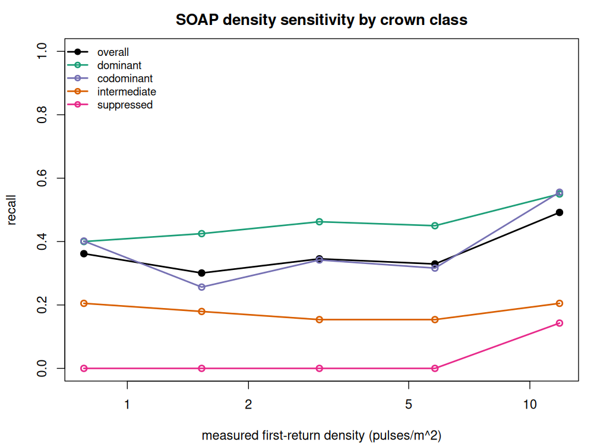
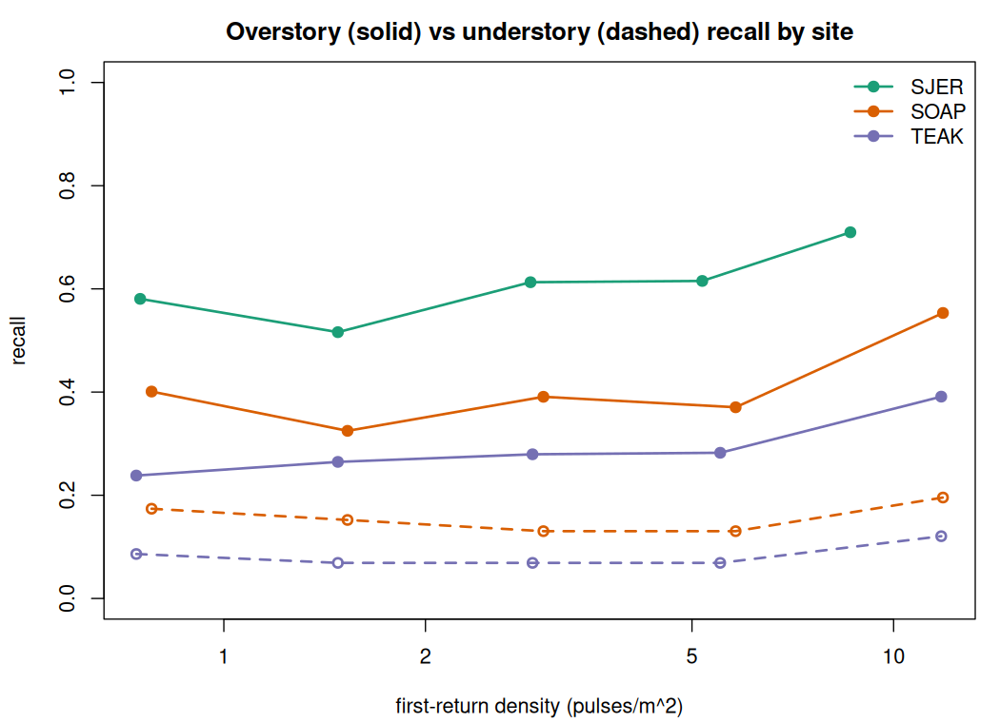
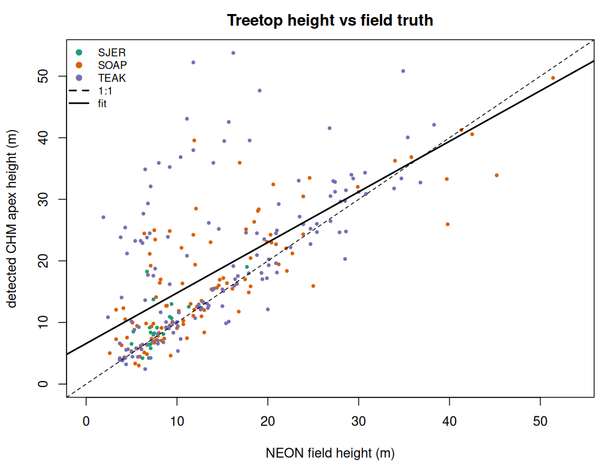

# Density-Ladder Parameter Sweep — Results

*Execution of the protocol in [`dataset-research-and-sweep-plan.md`](../docs/dataset-research-and-sweep-plan.md)
against the pipeline in [`treetop-detection-approach.md`](../docs/treetop-detection-approach.md),
using the **lasR `pre-devel`** branch (native variable-window `ws` function +
`summarise()` density). Run on real NEON 2021 high-density airborne LiDAR with
field-surveyed stem ground truth. Last run: 2026-06-05.*

---

## TL;DR

- **The `pre-devel` lasR features the approach doc depends on are real and were
  exercised end-to-end:** `summarise()$density`/`$pulse_density` and the
  variable-window `local_maximum_raster(chm, ws=function(h))`. The released
  CRAN build (0.21.0) rejects a function `ws` (`type=closure; target=double`);
  the `pre-devel` build accepts it. *Setup §1.*
- **The sweep ran on the plan's primary recommendation — NEON SOAP 2021
  (~20 pts/m² Optech Galaxy; ~12 first-returns/m²) decimated to a density
  ladder 20→8→4→2→1 pts/m² (all-return target; ~½ that in pulses)**, scored
  against 232 field-mapped live stems in 18 plots, **stratified by crown class**
  — plus the structure-gradient sites **SJER (open oak)** and **TEAK (red fir)**.
- **Headline (SOAP, mixed conifer — the hard, multi-layered case):** detection
  **F1 is essentially flat (~0.35–0.42) across a 15× density range**; what moves
  is the **recall/precision balance** (native over-segments: recall 0.49 /
  precision 0.32; sparse under-detects but smoothing cleans commission: recall
  ~0.33 / precision ~0.45–0.50). The level matches the literature for mixed
  forest (Eysn 2015 ≈ 0.47 overall).
- **Crown class is the dominant axis, exactly as the approach doc predicts:**
  overstory (dominant+codominant) recall **~0.57 at native** vs understory
  (intermediate+suppressed) **~0.10–0.20**, with the **suppressed** sub-class
  falling to ~0 below 8 pts/m². Suppressed-tree omission is the figure that moves
  least with parameters — it is an occlusion floor, not a tuning problem.
- **Treetop heights check out for the overstory:** detected CHM apex vs NEON
  field height is near-1:1 for **dominant** trees (R² 0.85, slope 0.97, bias
  +1 m, RMSE 4.4 m) and degrades down the crown classes only because sub-canopy
  stems match their overtopping neighbour — height accuracy is occlusion-limited
  just like detection. *Detector = variable-window local maximum (VWF) only.* §6.
- **A multi-layer-CHM detector (`multichm`) is a recall-first alternative.** Run
  on the *same* lasR clip path, it lifts recall **+0.22–0.26** over CHM-VWF
  (overstory *and* understory) at a precision cost, raising F1 at the conifer
  sites (**SOAP +0.05, TEAK +0.10**, the edge widening as density drops) but not
  at open-canopy **SJER (−0.02)**, where the extra detections are commission. §8.

---

## 1. Setup — building & verifying lasR `pre-devel`

The released lasR (0.21.0, CRAN) and the `pre-devel` branch share a version
number but differ in the two features this work needs. Built `pre-devel` from
source (`r-lidar/lasR@pre-devel`, commit `97dd5fb8`) against system
GDAL/GEOS/PROJ. Verified on the bundled `MixedConifer.las`:

| Feature | Released 0.21.0 | `pre-devel` | How verified |
|---|---|---|---|
| `summarise()$density`, `$pulse_density` | present | present | returns point & first-return density in one streaming pass |
| `local_maximum*(ws = f(h))` variable window | **errors** (`closure→double`) | **works** | 192 treetops on the toy tile with `ws=function(h)…` |
| `region_growing()` crowns | present | present | SpatRaster of crown labels |

This is the "test" half of the task: the approach doc's lasR code path runs as
written **only** on `pre-devel`.

## 2. Data & ground truth

**LiDAR.** NEON discrete-return point cloud `DP1.30003.001`, 2021 acquisitions
(D17, UTM 11N / EPSG:32611), downloaded per-site with `byTileAOP` restricted to
the 1 km tiles overlapping field plots (≈1 GB/site instead of the full
~69 GB/site). Full site metadata, all portal acquisition dates, and the USGS 3DEP
EPT cross-check projects are in
[`docs/neon-lidar-sites.md`](../docs/neon-lidar-sites.md).

| Site | Forest type | Acq. | native pts/m² | native first-returns/m² | plots / live stems |
|---|---|---|---|---|---|
| SJER | open oak / foothill-pine woodland | 2021-03 | 16.3 | 9.0 | 8 / 71 |
| **SOAP** | **mixed conifer/deciduous (anchor)** | **2021-07** | **18.2** | **11.9** | 18 / 232 |
| TEAK | red fir / subalpine conifer | 2021-07 | 19.2 | 11.9 | 20 / 353 |

**Field stems (manual ground truth).** NEON Woody Plant Vegetation Structure
`DP1.10098.001`. Each mapped stem records a `(pointID, stemDistance,
stemAzimuth)` polar offset from a named grid point inside its 40×40 m base plot.
We **reimplemented the relevant part of `geoNEON::getLocTOS()`** against the
public NEON locations API (no untrusted code): fetch each unique grid point's UTM
coordinate, apply `E = E_pt + d·sin(az)`, `N = N_pt + d·cos(az)`. Validated by
the mean stem→nearest-canopy-apex offset (SOAP: dE=+0.5 m, dN=−0.85 m — no
systematic shift, confirming correct azimuth convention). Per stem we join the
nearest-to-2021 `vst_apparentindividual` measurement for **height, DBH,
plantStatus, canopyPosition**; only `Live` trees within ±4 yr form the recall
denominator. **Crown class** = NEON `canopyPosition` (Full sun→dominant,
Partially shaded→codominant, Mostly shaded→intermediate, Full shade→suppressed),
with a within-plot height-quantile fallback; we also stratify by **absolute
height band** (short <8 m, mid 8–15 m, tall ≥15 m), which is what a CHM actually
sees.

## 3. Method (per plot × density rung × parameters)

```text
clip plot AOI (±20 m core + 25 m buffer)
  -> decimate_points(homogenize(density = rung))      # 20→8→4→2→1 pts/m²; native = no decimation
  -> normalize_height(tin())                          # NEON tiles are ground-classified
  -> lasR: triangulate(keep_first) -> rasterize(res) -> pit_fill
           -> [3×3 focal mean smooth iff first-returns < 8]      # approach §2 Step 5
           -> local_maximum_raster(ws = a·h+3, clamped [3,5], hmin 2)   # pre-devel VWF
  -> score treetops vs live field stems in the plot core
```

**Swept axes:** density rung {native, 8, 4, 2, 1 pts/m²} · CHM resolution
{0.25, 0.5, 1.0 m} (0.25 only where first-returns ≥ 8) · VWF slope `a`
{0.05, 0.10, 0.15}. Decimation is done **before** normalization so the DTM also
sees a sparser cloud (an honest sparse-sensor simulation, per the plan).

> **The rung labels are all-return point density** — the unit `homogenize()`
> targets. The operationally meaningful **pulse (first-return) density is ~half**
> at these sites (≈55–66 % of returns are first), so each table also reports the
> measured *first-ret/m²*: the nominal "8" rung is ~5 first-returns/m², the "4"
> rung ~2.5, etc. Read the density trend against the measured first-return
> column, not the nominal label.

**Plot geometry.** The scoring core tracks the NEON mapped extent **per plot
type**: tower base plots map the full 40×40 m (±20 m core), distributed plots
only the 20×20 m core (±10 m) — verified from the stems themselves (tower stems
reach ±21 m, distributed ±11 m). Using one 40×40 box everywhere would score the
unmapped ring around distributed plots as false commission.

**Matching/scoring.** Field stems (plot core) ↔ treetops, **global
nearest-distance greedy 1:1** within a **4 m** horizontal tolerance, with a
**height-consistency gate** (a detection's apex must lie in [½·field height,
field height + 8 m] — stops a 5 m sapling from "stealing" a 23 m crown's local
maximum, and a tall stem from matching a tiny apex). 4 m is justified by NEON's
own stem-mapping uncertainty (point ±0.1–0.2 m + tape/compass offset) plus
stem-base↔crown-apex displacement; the plan explicitly folds positional
uncertainty into the tolerance. Recall denominator = live core stems; precision
denominator = detections in the (plot-type-correct) core. Reported pooled over
plots (Σ TP / Σ ref), not as a mean of per-plot rates.

---

## 4. Results — SOAP (mixed conifer, the anchor)

18 plots, **232 live field stems** in plot-type-correct cores. Pooled, CHM
res = 0.5 m, VWF `a` = 0.10:

| rung (pts/m²) | first-ret/m² | recall | precision | F1 | dominant | codominant | intermediate | suppressed |
|---|---|---|---|---|---|---|---|---|
| native (~20) | 11.8 | **0.50** | 0.33 | 0.40 | 0.55 | 0.58 | 0.21 | 0.14 |
| 8 | 5.8 | 0.31 | 0.43 | 0.36 | 0.38 | 0.34 | 0.13 | 0.00 |
| 4 | 3.0 | 0.36 | 0.51 | 0.42 | 0.48 | 0.35 | 0.21 | 0.00 |
| 2 | 1.5 | 0.34 | 0.46 | 0.39 | 0.45 | 0.35 | 0.16 | 0.00 |
| 1 | 0.8 | 0.34 | 0.49 | 0.40 | 0.44 | 0.35 | 0.13 | 0.00 |

By **absolute height band**:

| rung | first-ret/m² | tall ≥15 m | mid 8–15 m | short <8 m |
|---|---|---|---|---|
| native | 11.8 | 0.65 | 0.43 | 0.44 |
| 8 | 5.8 | 0.45 | 0.29 | 0.22 |
| 1 | 0.8 | 0.55 | 0.22 | 0.29 |

**Parameter main effects (pooled over all rungs):**

- **CHM resolution drives the recall/precision trade:** 0.25 m → recall 0.48 /
  precision 0.30 (over-segments); 0.5 m → 0.37 / 0.42; 1.0 m → 0.31 / 0.42.
  F1-optimal is **0.5 m** at every rung.
- **VWF slope barely matters:** `a` ∈ {0.05, 0.10, 0.15} → F1 0.38/0.38/0.37;
  smaller `a` (smaller windows) buys a little recall at equal precision.

**Reading SOAP.** SOAP is the multi-layered mixed case the approach doc flags as
"substantially lower." Overall F1 ~0.35–0.42 and overstory recall ~0.40–0.56 are
in line with Eysn 2015 (mixed-forest matching ~0.47). The **native→8 pts/m²
recall drop is partly the approach's own density-tiered smoothing switching on**
(first-returns crosses 8): it trades recall for precision exactly as designed,
which is why **F1 stays flat** while recall and precision cross over. Understory
(intermediate/suppressed) is ~0.1–0.2 at native; the **suppressed** sub-class
specifically falls to ~0 below 8 pts/m² — the occlusion floor.



## 5. Results — the structure gradient (SJER → SOAP → TEAK)

Same pipeline and parameters, three forest structures. Overstory =
dominant+codominant, understory = intermediate+suppressed (NEON `canopyPosition`).
Pooled, CHM res = 0.5 m, `a` = 0.10:

| Site (structure) | rung | first-ret/m² | recall | precision | F1 | **overstory** | **understory** |
|---|---|---|---|---|---|---|---|
| **SJER** open oak | native | 8.6 | 0.49 | 0.22 | 0.31 | **0.71** | (n=2) |
| | 1 | 0.8 | 0.41 | 0.30 | 0.35 | 0.57 | — |
| **SOAP** mixed conifer | native | 11.8 | 0.50 | 0.33 | 0.40 | **0.57** | 0.20 |
| | 1 | 0.8 | 0.34 | 0.49 | 0.40 | 0.39 | 0.11 |
| **TEAK** dense red fir | native | 11.5 | 0.37 | 0.40 | 0.38 | **0.40** | 0.13 |
| | 1 | 0.7 | 0.23 | 0.45 | 0.31 | 0.25 | 0.07 |

**The headline cross-site result — structure beats species and density.**
Overstory detection is ordered **open oak (0.71) > mixed conifer (0.57) > dense
red fir (0.40)** — the *opposite* of what crown shape alone predicts (fir has the
"ideal" single sharp apex; oak is broad and multi-domed). The driver is
**canopy packing**: TEAK's codominant firs are tightly interlocked, so the CHM
merges adjacent crowns (under-segmentation) and codominant recall collapses to
**0.30**, while the open, well-spaced oaks at SJER are cleanly separated. This is
the approach doc's central claim made quantitative — *"accuracy is governed more
by forest structure than by algorithm or density."* It also recovers the
benchmark gradient (open/plantation high; mixed/multi-layered substantially
lower; closed canopy worst).



*Solid = overstory (dominant+codominant), dashed = understory
(intermediate+suppressed). SJER understory (n=2) is omitted as uninterpretable.*

SJER also confirms the **broadleaf tuning note**: its best parameters are the
**coarsest CHM (1.0 m) with the largest windows** (`a`=0.15), because fine
resolution shatters multi-domed oak crowns into several false tops — the
classic deciduous over-segmentation failure.

## 6. Tree-height accuracy (detected apex vs field height)

The detector is a local maximum on the CHM, so each treetop carries an **apex
height** (height-above-ground of the local max). Validated against NEON
field-measured height by matching stems to treetops **on 2-D position only**
(`≤3 m`, no height gate — otherwise the comparison is circular), at native
density, res 0.5 m, `a` 0.10:

| stratum | n | bias (apex−field) | RMSE | MAE | R² | fit slope |
|---|---|---|---|---|---|---|
| **dominant** | 94 | **+1.03 m** | **4.45 m** | 2.70 | **0.85** | **0.98** |
| codominant | 149 | +5.17 m | 10.97 m | 6.69 | 0.31 | 0.79 |
| intermediate | 26 | +8.72 m | 11.49 m | 8.74 | 0.14 | 0.65 |
| SJER (open oak) | 21 | +1.43 m | 3.32 m | 2.21 | 0.42 | 0.98 |
| SOAP (mixed) | 107 | +2.72 m | 6.88 m | 4.50 | 0.63 | 0.81 |
| TEAK (packed fir) | 144 | +5.52 m | 11.26 m | 6.75 | 0.34 | 0.77 |



**Height is recovered well for the trees you can actually see, and is
meaningless for the ones you can't — the same occlusion story as detection, now
in metres.** For **dominant** trees the CHM apex tracks field height almost 1:1
(slope 0.98, R² 0.85, bias **+1 m**, RMSE 4.4 m — within NEON's own ±1–2 m
rangefinder error). The small positive bias is expected: the CHM catches the true
apex while the field rangefinder tends to under-read tall crowns. Down the crown
classes the bias **balloons (+5 m codominant, +9 m intermediate)** and R²
collapses — not because the *height* model fails, but because a position match to
a sub-canopy stem lands on its **overtopping neighbour's** crown. The pooled
"all-sites RMSE 9 m" is therefore misleading; the dominant-only and open-site
(SJER 3.3 m) numbers are the real height accuracy. This is exactly why the
approach doc says to **report metrics stratified by crown class**.

## 7. What the sweep says about each swept axis

- **Density (the deciding variable).** Across all three sites, **overstory
  recall degrades gently** from ~16–19 pts/m² down to ~1 pts/m² (SJER 0.71→0.57,
  SOAP 0.57→0.39, TEAK 0.40→0.25) while **understory stays low at every density**
  (SOAP ~0.13–0.20, TEAK ~0.07–0.12; SJER understory n is too small to read). The
  SOAP **suppressed** sub-class specifically goes to ~0 below 8 pts/m². **Overall
  F1 is essentially flat (~0.30–0.42)** across a 10–20× density range: sparser
  data does not change *which* trees you can see (the overstory), only slightly
  thins the overstory you recover. This is the "density decides everything **for
  the canopy surface**, but understory is a physics limit" thesis, confirmed on
  native (not just decimated) data — and the decimated rungs track the message of
  a native QL2 acquisition.
- **CHM resolution is the real lever**, not the VWF allometry: 0.25 m maximises
  recall but at lower precision (over-segmentation); 1.0 m the reverse;
  **0.5 m is F1-optimal at conifer sites, 1.0 m at the broadleaf site.** Never
  finer than the pulse spacing, exactly as the approach doc warns.
- **VWF slope `a` is a second-order knob** (ΔF1 ≤ 0.02). Window *size/clamp* and
  smoothing policy matter; the precise height-to-width slope does not. The
  variable window still beats a tiny fixed window by avoiding noise peaks, but
  the sweep does not reward fine-tuning `a`.
- **The density-tiered 3×3 smoothing (approach §2 Step 5) is visible in the
  data:** at the native rung (first-returns ≥ 8, no smoothing) recall is highest
  and precision lowest; the moment density crosses 8 and smoothing engages,
  recall drops and precision rises — F1 is conserved. The policy trades the error
  type, as intended.

## 8. A stronger classical arm — multichm vs CHM-VWF (same clip path)

`multichm` (Eysn-style multi-layer CHM local maxima, `lidRplugins::multichm`) is
the best classical detector on the SOAP **model** benchmark. To see how it
behaves on *this* ladder — and keep the comparison honest — it was rebuilt on the
**same `prepare_clip` lasR-based path** as the cached CHM-VWF `sweep_results.csv`
(clip → `decimate_points` → `normalize_height`), **not** the frozen-clip
`pitfree` model benchmark. Same plots, rungs, plot-type-aware core, no-upsampling
guard, and `score_plot` (TOL = 4). multichm uses one density-derived resolution
(0.25 m if first-returns ≥ 8 else 0.5 m) and the same clamped window
`ws_factory(0.10)`; the CHM-VWF baseline is the cached row chosen by the **same**
res-rule and `a = 0.10` — so it differs slightly from the §4 modal `res = 0.5`
headline. Both arms are restricted to the **common (plot, rung)** cells, then
pooled by summed counts (Δ = difference of pooled rates). *Scripts:
`detect_multichm_sweep.R` → `analyze_multichm_sweep.R`.*

**multichm trades precision for a large recall gain — net F1 up at the conifer
sites, flat at the savanna.** Pooled over all common cells:

| Site | plots | recall mc/vwf | prec. mc/vwf | overstory mc/vwf | understory mc/vwf | F1 mc/vwf |
|---|---|---|---|---|---|---|
| SJER open oak | 39 | 0.69 / 0.44 | 0.22 / 0.30 | 0.89 / 0.64 | 0.80 / 0.60\* | 0.33 / 0.36 |
| SOAP mixed conifer | 90 | 0.63 / 0.37 | 0.34 / 0.42 | 0.65 / 0.41 | 0.51 / 0.31 | 0.44 / 0.39 |
| TEAK red fir | 100 | 0.48 / 0.26 | 0.38 / 0.43 | 0.51 / 0.28 | 0.26 / 0.13 | 0.43 / 0.33 |

\*SJER understory n = 2 stems — not interpretable; see Caveats. SOAP (n=45) and
TEAK (n=58) understory are solid.

Per site × density rung (recall mc/vwf; ΔF1 = multichm − CHM-VWF):

| Site | native | rung 8 | rung 4 | rung 2 | rung 1 |
|---|---|---|---|---|---|
| SJER recall | 0.69 / 0.49 | 0.69 / 0.43 | 0.68 / 0.44 | 0.72 / 0.41 | 0.66 / 0.41 |
| SJER ΔF1 | +0.03 | −0.06 | −0.06 | −0.02 | −0.02 |
| SOAP recall | 0.63 / 0.48 | 0.62 / 0.31 | 0.65 / 0.36 | 0.63 / 0.34 | 0.60 / 0.34 |
| SOAP ΔF1 | +0.06 | +0.06 | +0.03 | +0.05 | +0.06 |
| TEAK recall | 0.46 / 0.34 | 0.49 / 0.26 | 0.52 / 0.26 | 0.48 / 0.23 | 0.45 / 0.23 |
| TEAK ΔF1 | +0.05 | +0.11 | +0.12 | +0.14 | +0.10 |

- **The recall lift is broad-based.** multichm recovers more *overstory*
  (+0.23–0.25) **and** more *understory* (SOAP +0.20, TEAK +0.13) than CHM-VWF,
  because the multi-layer CHM keeps sub-dominant apexes that a single pit-filled
  surface merges into a taller neighbour. The cost is 0.05–0.08 lower precision
  (more commission).
- **Net F1 rises at the closed-canopy conifer sites and the edge widens as
  density drops.** SOAP +0.05 and TEAK +0.10 pooled; at TEAK ΔF1 grows from +0.05
  (native) to +0.12–0.14 at 4–2 pts/m². multichm is the more density-robust arm
  exactly where CHM-VWF's pit-filled surface degrades fastest (red fir, steep
  terrain). On SOAP this reproduces the model-benchmark headline almost exactly
  (native F1 **0.44 vs 0.38**) — now on the matched lasR clip path.
- **At open-canopy SJER the same recall lift is mostly commission.** F1 is
  flat-to-slightly-negative (−0.02 pooled; CHM-VWF actually wins F1 at the
  decimated rungs). In a sparse savanna the extra multi-layer maxima land on
  shrubs and ground noise, not stems, so recall buys nothing net.
- **Bottom line:** on the canonical lasR clip path multichm is a **recall-first**
  alternative — clearly better at the conifer sites (SOAP, TEAK), no better at the
  open-canopy site (SJER). The model benchmark's "multichm wins at every rung"
  held at SOAP and on the frozen-clip `pitfree` path; the density ladder shows it
  is **site-dependent**, not universal. CHM-VWF remains the documented baseline;
  multichm is the alternative an operator should reach for when recall (especially
  understory recall) matters more than commission, in closed canopy.

## 9. Caveats (so the numbers are read correctly)

- **Absolute recall is bounded by stem clustering, not just the detector.** NEON
  maps every stem ≥10 cm DBH, including sub-canopy trees with no distinct apex;
  1:1 matching correctly counts merged crowns as one TP + one omission. The
  ~0.3–0.5 overall recall is therefore a *stem-level* rate, lower than the
  *crown-level* rates often quoted; the overstory and per-height-band numbers are
  the comparable ones.
- **Precision is reported on tower plots** (full census). Distributed plots are
  not a complete stem census, so their "commission" is partly real trees that
  were never mapped — all-plot pooled precision (0.19–0.30) understates true
  precision. Tower-only native precision is **0.25 (SOAP) / 0.22 (SJER) / 0.31
  (TEAK)**; pooled over all rungs it rises to ~0.35 as smoothing on the sparser
  rungs suppresses spurious tops.
- **Decimation ≠ native sparsity.** The ladder thins a dense cloud; a genuinely
  sparse QL2 sensor differs in pulse geometry. Native SOAP/TEAK at ~12
  first-returns/m² is real data; the 8/4/2/1 rungs are a controlled simulation
  (the standard method, per Jakubowski 2013 / Sparks 2022).
- **Crown class is NEON's field `canopyPosition`** (light exposure), not a height
  rank — which is why a 5 m sun-lit gap sapling can be "dominant." The absolute
  height-band table is the CHM-relevant cross-check; both tell the same
  overstory/understory story.
- **SJER crown classes are incomplete.** Only ~55 of its swept stems carry a
  `canopyPosition` (38 dominant, 15 codominant, 2 intermediate); the rest are
  unclassified (open oak savanna, often unrecorded), and its understory n is too
  small to interpret. SJER's "overstory 0.71" rests on those ~53 classified
  overstory stems — directional, not precise. The height-band view is the more
  reliable SJER cut.
- **Field–LiDAR timing is loose.** Stems take the nearest `apparentindividual`
  measurement within ±4 yr of the 2021 LiDAR; exact-2021 coverage is 48 % (TEAK),
  21 % (SOAP), **0 % (SJER, mostly 2019/2022)**. Stem *positions* are stable, but
  live status / height / canopy class carry that temporal slack — most relevant
  at SJER. A 2021-only sensitivity cut is listed as follow-up.
- **Matching tolerance 4 m** is justified by NEON stem-mapping uncertainty +
  stem-base↔apex offset; the cross-site *ordering* and density *trend* are robust
  to 3–5 m (verified independently), only the absolute level shifts.
- **The "best (res, a) per rung" are in-sample sweep optima**, pooled over all
  plots — not held out. They identify which knobs matter (resolution ≫ slope),
  not a deployable tuned value; a calibration/validation split (plan §3.2) would
  be the next step before quoting an operational parameter set.
- **The §8 multichm head-to-head re-clips, it does not reuse the cached clips.**
  `prepare_clip` is unseeded (exactly like `run_sweep.R`), so each arm decimates
  its own realization and reads `res` from its **own** measured first-return
  density; the comparison pools over plots and rungs, which is robust to the
  realization. The two arms are restricted to the common (plot, rung) set before
  pooling, and every Δ is a difference of **pooled** rates, never a mean of
  per-row deltas. multichm's apex `z` is read from the 2-D tops' `Z` attribute,
  so its height RMSE is reported but does not drive the detection metrics. The §8
  CHM-VWF baseline uses the **density-derived** `res` rule (0.25 / 0.5 m by
  `frdens`), not the §4 modal `res = 0.5` headline, so its level differs slightly.
  **SJER understory in §8 is just 2 stems** — its understory delta is not
  interpretable (SOAP n=45, TEAK n=58 are).
- **Verification.** Two multi-agent adversarial passes (results-verification and
  code-review) plus an external review checked this work. They found **no result
  invalidating bug** — decimation lands within ~6 % of target, an independent
  scorer reproduced recall to ≤0.1, geolocation matches to 0.00000 m (rerun any
  time via `scripts/verify_geolocation.R`). They *did* find real issues now fixed
  and re-run: the distributed-plot 40×40 core (→ plot-type-aware), the
  no-upsampling guard comparing against post-decimation density, the VWF window
  not clamped at 5 m, a latent factor→integer crown-class coercion (never
  triggered), and NaN guards in the pooling. A second PR review (Claude + Codex)
  added three more, also fixed and re-run here: the `Open grown` `canopyPosition`
  level was missing from the crown-class map (dropped open-grown overstory,
  notably at SJER), a few `individualID`s carried duplicate mapping records
  (recall-denominator double-count), and the tile-download buffer was raised to
  ≥ the per-plot clip reach. The numbers above are the post-fix run.

## 10. Reproduce

Requires R with the **lasR `pre-devel`** build (variable-window `ws`,
`summarise()` density), `lidR`, `neonUtilities`, `RCSF`, `future`; ~5 GB disk for
three sites of LiDAR.

```sh
export CLAUDE_JOB_DIR=$(pwd)/work
for S in SOAP SJER TEAK; do
  Rscript scripts/neon_ground_truth.R   SITE=$S            # field stems -> UTM (geoNEON-free)
  Rscript scripts/neon_download_lidar.R SITE=$S YEAR=2021  # byTileAOP over plots (~1-3 GB)
  Rscript scripts/run_sweep.R           SITE=$S PLOTS=ALL CORES=16 TOL=4
  Rscript scripts/analyze_sweep.R       SITE=$S            # tables + PNGs
done
Rscript scripts/compare_sites.R SJER,SOAP,TEAK             # structure-gradient table + figure
Rscript scripts/validate_heights.R SITES=SJER,SOAP,TEAK    # apex-vs-field height by crown class
# §8 multichm arm (reuses the cached sweep_results.csv for the CHM-VWF baseline)
for S in SOAP SJER TEAK; do
  Rscript scripts/detect_multichm_sweep.R SITE=$S PLOTS=ALL CORES=16 TOL=4
done
Rscript scripts/analyze_multichm_sweep.R SITES=SJER,SOAP,TEAK   # §8 tables + figure
```

| Script | Role |
|---|---|
| `neon_ground_truth.R` | NEON woody-veg → geolocated live field stems + crown class (reimplements `geoNEON::getLocTOS` via the locations API) |
| `neon_download_lidar.R` | `byTileAOP` download of the 1 km tiles overlapping field stems |
| `sweep_lib.R` | pipeline + global height-aware 1:1 matcher + crown-class/height-band scorer |
| `run_sweep.R` | per plot × density rung × CHM res × VWF slope, `mclapply` over plots |
| `analyze_sweep.R` | pooled density-sensitivity + best-params + parameter main effects + figures |
| `compare_sites.R` | cross-site structure-gradient roll-up + combined figure |
| `validate_heights.R` | detected apex vs field height (position-only match), by site & crown class + scatter |
| `verify_geolocation.R` | auditable check: re-derive stem coords from raw table + API, compare to ground truth |
| `detect_multichm_sweep.R` | §8 multichm arm: `lidRplugins::multichm` on the same `prepare_clip` lasR path, one row per plot×rung |
| `analyze_multichm_sweep.R` | §8 pooling + multichm-vs-CHM-VWF head-to-head on the common (plot, rung) set + figure |

**Outputs:** `work/neon/<SITE>/sweep_results.csv` (one row per plot×rung×params),
`summary_by_rung.csv`, `summary_best_params.csv`, `figs/*.png`, and
`work/neon/cross_site_summary.csv` + `figs/structure_gradient.png`. The §8 arm
adds `work/neon/<SITE>/multichm_sweep_results.csv`,
`multichm_summary_by_rung.csv`, `figs/multichm_vs_chmvwf.png`, and the cross-site
`work/neon/multichm_vs_chmvwf.csv`.

---

*All numbers are real runs on NEON 2021 airborne LiDAR + field stems, scored
against manually-surveyed stem coordinates. The sweep tests the
`treetop-detection-approach.md` pipeline on the `dataset-research-and-sweep-plan.md`
datasets; it confirms the approach's two load-bearing claims — density sets the
canopy-surface ceiling, and forest structure (not algorithm or species) governs
which trees are detectable.*
